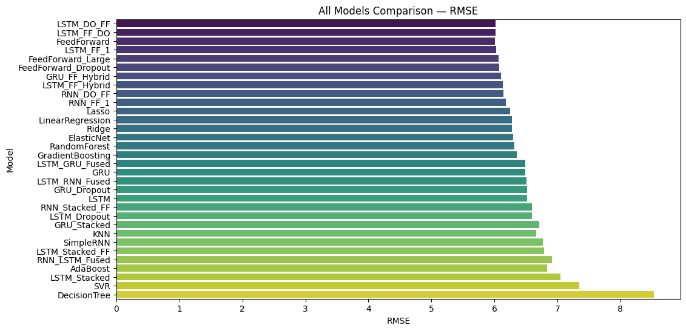
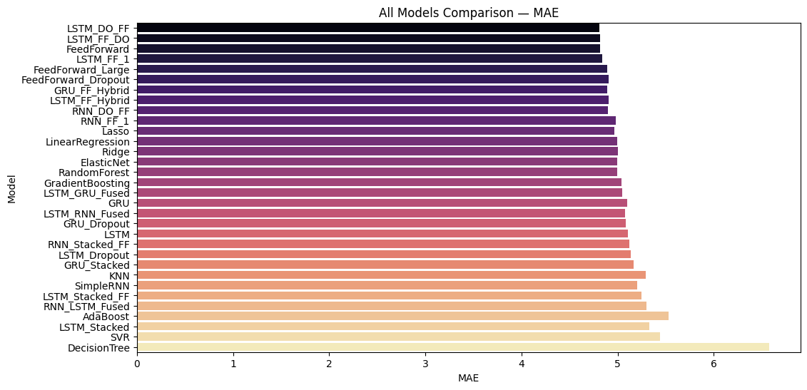

# Mental Health Forecasting Project

## Overview
This project predicts depression scores using **machine learning (ML)** and **deep learning (DL)** models.  
The dataset includes features related to mental health, demographics, socioeconomic factors, and anxiety scores.

## Visual Results

### RMSE Comparison


### MAE Comparison



### Dataset
The dataset includes columns such as:
- Education, Province, Age
- Mental Disorder History
- Suicidal Attempt History
- Living Conditions
- Economic Income
- Anxiety scores (State & Trait)
- Region

The target variable is `DEPRESSION` score.  
**Note:** The dataset is accessed via a web link (`csv` format) in the Colab/ scripts.

---

## Models Used

### Machine Learning (ML)
- Linear Regression, Ridge, Lasso, ElasticNet  
- Random Forest, Gradient Boosting, AdaBoost  
- Support Vector Regressor (SVR), KNN, Decision Tree  

### Deep Learning (DL)
- FeedForward Neural Network  
- LSTM, GRU, SimpleRNN  
- Stacked and Dropout variants  
- Hybrid models combining LSTM/GRU with FeedForward layers  

### Fused DL Models
- Combinations of LSTM + Dense, LSTM + GRU, RNN + LSTM, etc.  
- Designed to capture complex patterns in mental health data

---

## Project Structure
```

mental_health_forecasting/
│
├─ README.md # Project description and instructions
├─ requirements.txt # All dependencies
├─ data_preprocessing.py # Loads dataset, preprocessing, scaling
├─ ml_models.py # Trains & evaluates ML models
├─ dl_models.py # Trains & evaluates DL models
├─ fused_models.py # Trains & evaluates fused DL models
├─ evaluation_ranking.py # Ranks all models based on combined score
├─ mental_health_forcasting.ipynb
└─ Results
     └─ Graphs
          ├─ rmse_comparison.png
          ├─ mae_comparison.png
          ├─ all models compared.png
          └─ encoding 1.png evaluation_ranking.py # Ranks all models based on combined score
```

---

## How the Code Works
1. **Data Preprocessing:** Loads dataset, encodes categorical variables, splits into training and test sets, and scales features.  
2. **ML Models:** Trains multiple ML models, evaluates RMSE, MAE, and R², and stores results.  
3. **DL Models:** Trains various DL models including FeedForward, LSTM, GRU, SimpleRNN, and hybrids.  
4. **Fused DL Models:** Trains fused architectures combining multiple layers to improve forecasting power.  
5. **Evaluation & Ranking:** Normalizes metrics and calculates a combined score to rank models.  
6. **Visualization:** Generates bar plots for RMSE, MAE, and R² to compare model performances.  

## Best Performing Models
- Based on combined normalized score, **top models** include:
  - LSTM + FeedForward with Dropout  
  - GRU + FeedForward Hybrid  
  - Lasso (ML model)

These models capture both linear and nonlinear relationships in the dataset effectively.


## Google Colab Usage
You can run this project in Colab:

1. Open [Google Colab](https://colab.research.google.com/)  
2. Click **File → Upload Notebook** or create a new notebook  
3. Install dependencies:
```python
!pip install pandas numpy scikit-learn tensorflow seaborn matplotlib datasets
```

Load dataset from the web:
ds = load_dataset("fridriik/mental-health-arg-post-quarantine-covid19-dataset")

## Copy-paste the scripts from the modular Python files:
-Data preprocessing
-ML models
-DL models
-Fused models
-Evaluation & ranking
-Visualization

Run each cell step by step to train, evaluate, and visualize model performances.
